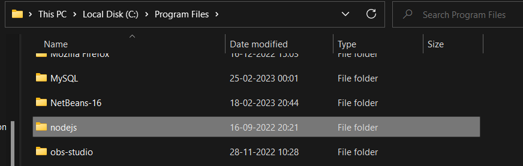
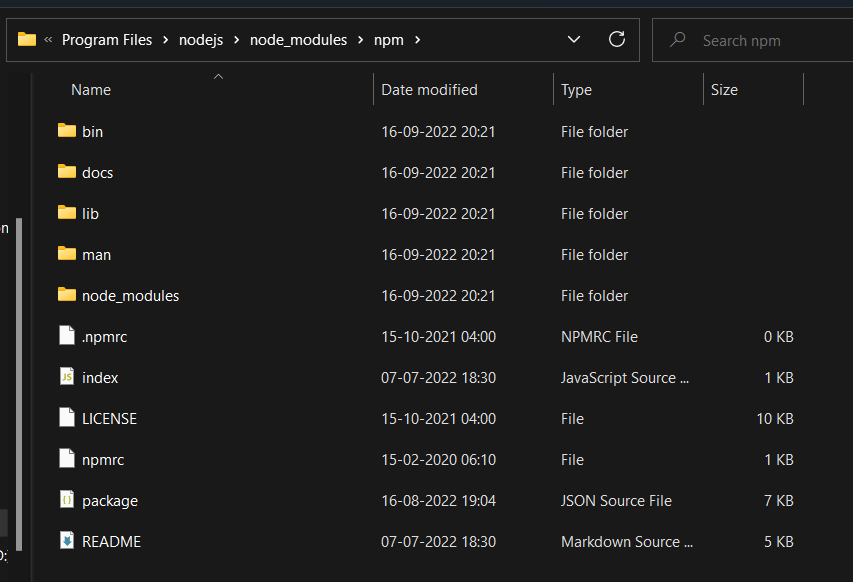
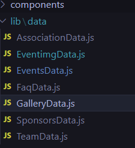
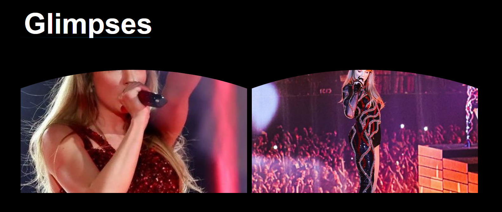
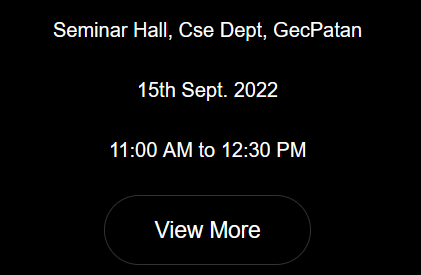
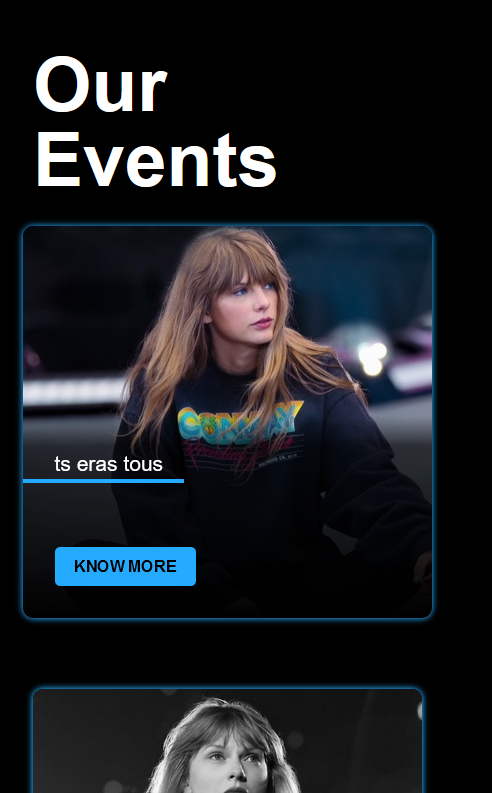
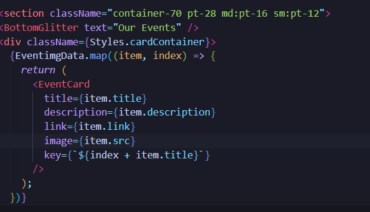

## Gernal instrucction

## pre 
need to have node
watch on youtube to install node on system 
just download node from node.js and run it go the explor / flie where it is install then check path copy and add var as node and then in npm folder 


[]
 

```bash
C:\Program Files\nodejs
```
then add env as node

#### npm 
[]

```bash
npm install yarn
```

install node page 
<hr />

# this was basic 
## clone  the repo

```bash
  
git clone https://github.com/code22hives/codev2
```


```bash
yarn install 
```
run node 
```bash
yarn run dev
```

# task for team 1
in page dir  change in every page flie when every on guys find meta change that 
```html
    <meta
          name="description"
          content="HnCC or Hackathon and Coding Club is the official club of BIT Sindri that has the motto to instill a coding culture, collaborate, and arrange events relevant to Open Source, Graphics and Game Development, Web Development, App Development, and many other topics."
        />
        <meta
          name="keywords"
          content="HTML, CSS, JavaScript, ReactJS, NextJS, TailwindCSS, HnCC, About HnCC, Hackathon & Coding Club, BIT Sindri, Dhanbad"
        />
```
change this type of content to your content
and also make favico smaller 
<br />
<hr />


# group 2

<hr />

#### flie content open Gallerydata
<br />

[]
<br />

```js
{
    src: '/gallery/ears1.jpg',
    mobileSrc: 'gallery/mobile/ears1.jpg',
    title: 'ts eras tous',
    id: 'pic1',
  },
```
<br />

## src = path 
it's 
```bash

codehivesv2\public\gallery
```

<br />

add phots it will reflect at index page 
#### npm 

<br />



#### i provide g drive assces just drop a message in personal 
<br />
<hr >

# team 3 
<hr >
page events 
url 
http://localhost:3000/events
<br />


<br />

### on clicking view more it should create a new page contains img of that 


<br />

<br />

<hr />

### change our events to glimpses and then event name 
<br />

#### change inst.js in page




in photo u see that EventimgData is an ARRAY IMPORT FROM LIB/DATA EVENTIMG 
SO AS U MAKE FOR EVENT ONE SAY U NAME Event1data

```bash
export const Event1data =[
  {

  }
]
  
```
### check out 
codehivesv2\lib\data\EventimgData.js

when u call it in flie call with that name as you export 

also 

```js
 {
    name: 'Inaugrating To Code Hives',
    description:"",
    image: '/events/event1.jpg',
    venue: "Seminar Hall, Cse Dept, GecPatan",
    date: "15th Sept. 2022",
    time: "11:00 AM to 12:30 PM",

        link: 'inst',
  },
```
in that add link to page you make in pages ie inst.js 
when u  create for that par.. event

<hr>
your folder for storeing img is 
<br>
codehivesv2\public\eventimg
<br>

# group 4 

<hr>

# check navbar 
soicalbar
<br>
footer
in componets section 

# at last when every u phase any error stand out in group some one or me will help u out 

# hope this weekend u guys will learn somewhat next.js 